ExDUIR
=======
[English](./README_EN.md)

## 简介

Windows平台轻量DirectUI框架。ExDUIR的.net框架封装。原版地址:https://github.com/williamlzw/ExDUIR
修改自https://github.com/F-Unction/ExDirectUI.NET

## 运行系统
win10+， win7 需要安装KB2670838补丁
.net 4.6.1

## 问题反馈&帮助
* 交流QQ群: 214406227

## 编译
* Visual Studio 2019,Visual Studio 2022

## 特点
* 绘制函数是DirectX11、Direct2D，效率比GDI高上百倍。
* Unicode编码，支持多国语言。
* 仿Windows消息机制，通过发送消息，分发通知给组件，兼容原生Windows消息和常量。win32 api写法，比类写法扩展性更灵活。
* 调用方式采用Win32风格API方式，支持生成lib静态库和dll动态库。生成的动态链接库支持被其它语言如python、java、go、dephi、C#、VB、易语言等调用。
* 扩展组件自由灵活，引擎处理底层逻辑。用户只需编写绘制代码，不需要考虑复杂的消息处理。
* 目前支持组件有按钮、开关、单选框、选择框、编辑框、富文本编辑框、列表框、报表列表、模板列表、分组框、组合框、菜单、树形框、滑块、单选框、选择框、选项卡、加载动画框、旋转图片框、页面、图片框、消息框、图标列表、列表按钮、工具条、状态条、日期框、调色板、颜色选择器、标题框、月历框、分数按钮、cef3浏览框、鼠标绘制板，可以在这些组件基础上超类化扩展组件。
* 支持布局，布局可以在窗口尺寸改变情况下自动更新组件位置。目前支持的布局有绝对布局，相对布局、线性布局、流式布局、表格布局。用户可以扩展布局。
* 支持GIF格式图片自动播放动画，支持图片格式PNG、JPEG、BMP、GIF、WEBP。窗口或组件都可以用以上格式图片做背景图。
* 支持34种缓动特效，用户可以自由编写窗口缓动或组件缓动特效。用户可以扩展缓动算法。
* 窗口支持异型窗口，图片形状窗口。窗口和组件支持0到255透明度。支持高斯模糊。
* 编辑框支持富文本，支持加载RTF格式文档。
* 窗口或组件支持接收拖曳文件或文本。
* 支持模态窗口。
* 支持限制区域消息通知。

## Demo
### demo code:  

### demo all:  

### button:  
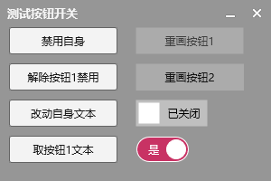

### combobox:  

### custombackground:  
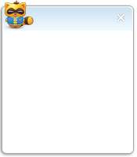

### easing:  
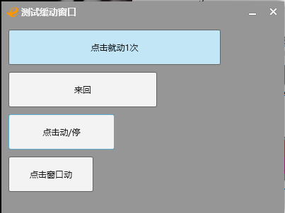

### edit:  

### groupbox:  
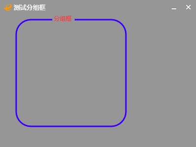

### irregular shape window:  
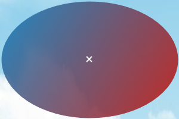

### label:  

### layout absolute:  
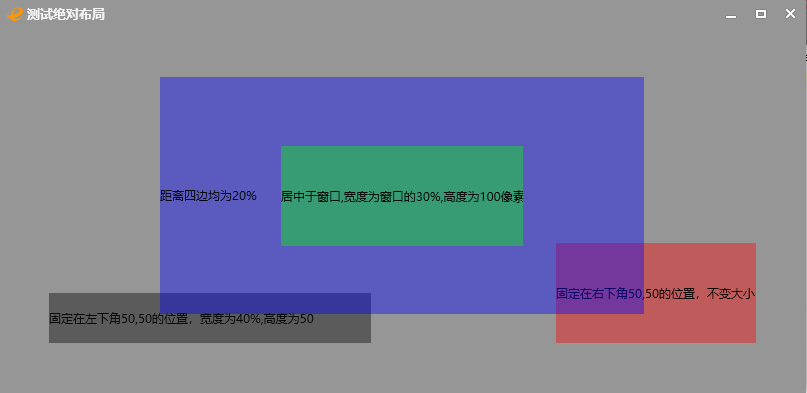

### layout flow:  
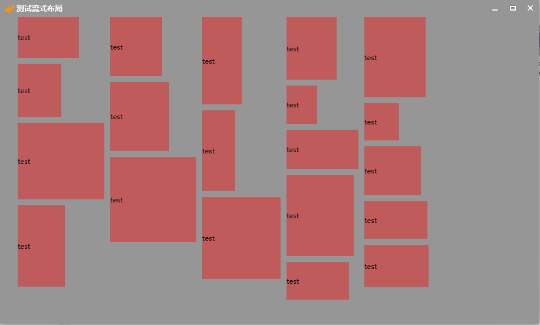

### layout linear:  
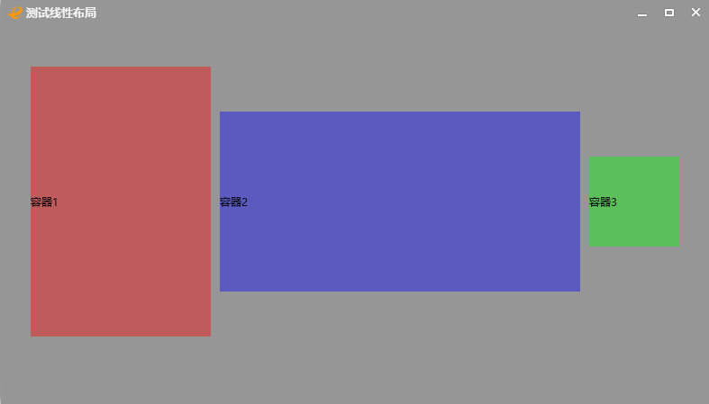

### layout relative:  
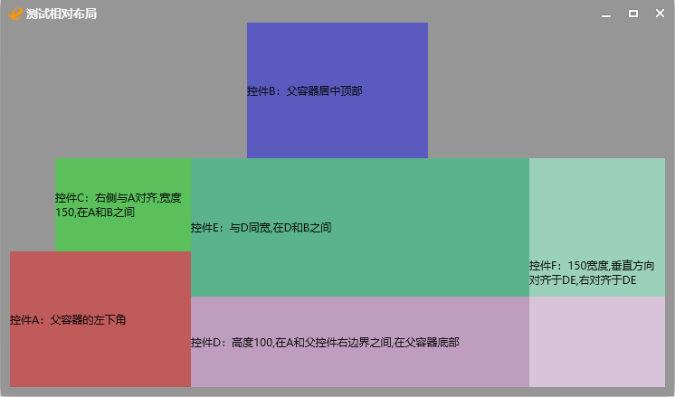

### layout table:  

### listbutton:  
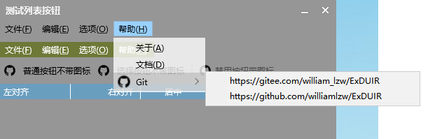

### listview:  
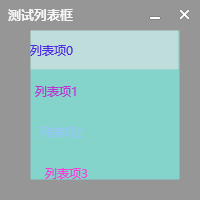

### navbutton:  
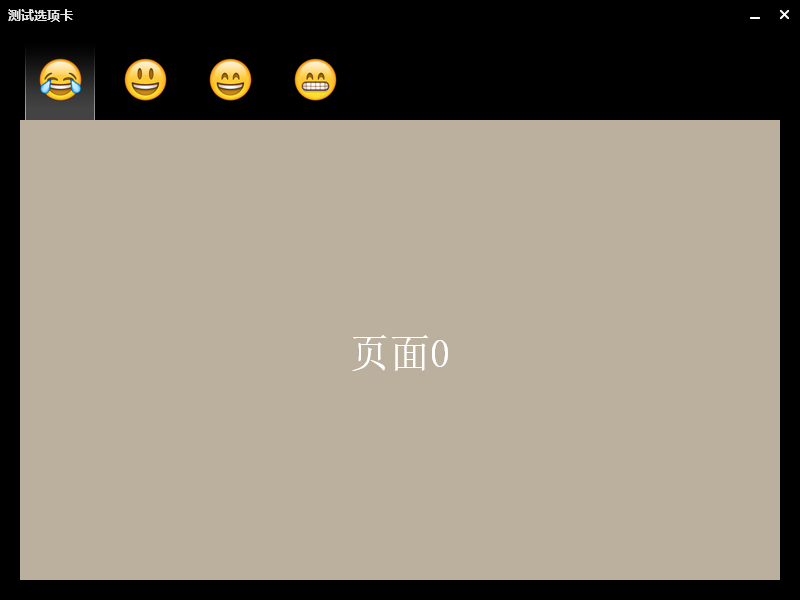

### radio and checkbox:  
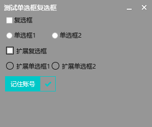

### reportlistview:  

### iconlistview:  
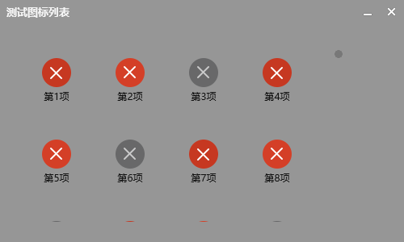

### treeview:  
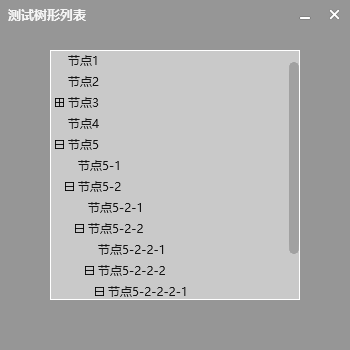

### matrix:  
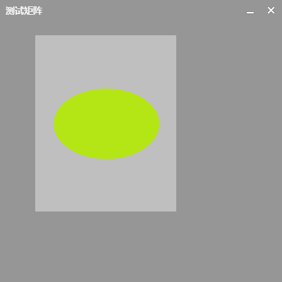

### buttonex:  
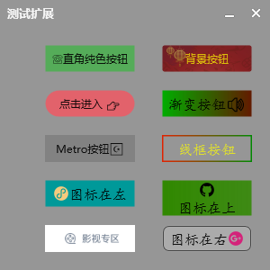

### editex:  

### custommenu:  

### eventdispatch:  

### loading:  
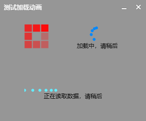

### sliderbar:  

### rotatebox:  

### drag obj:  

### progressbar

### notify obj

### titlebar
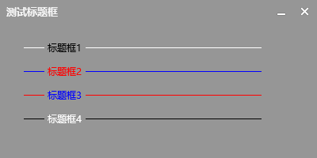

### datebox
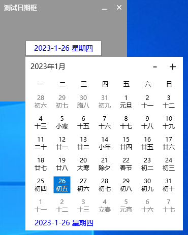

### colorpicker
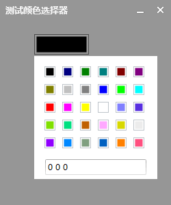

### scorebutton

### carousel
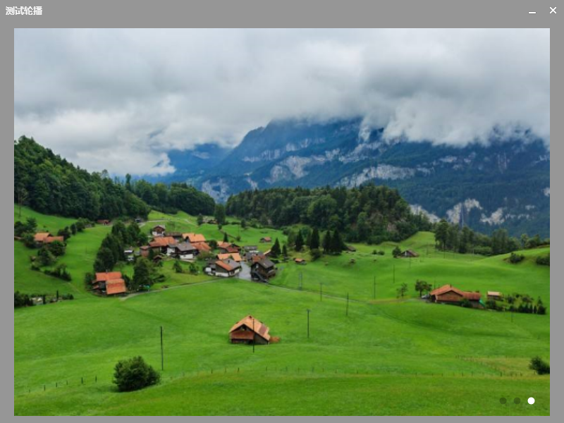

### template listview
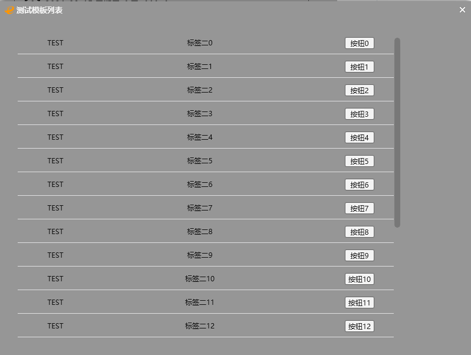

### drawingboard
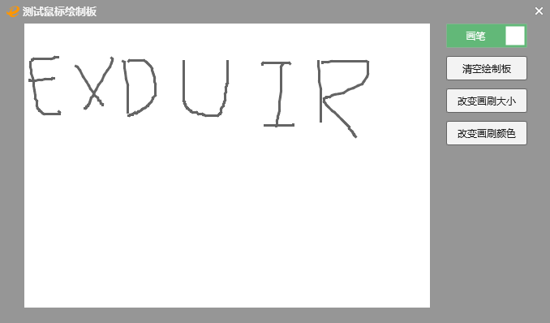

### propertygrid
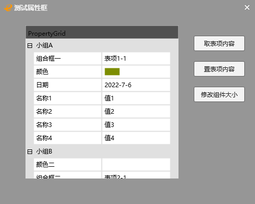

### mediaplayer

### svg and font
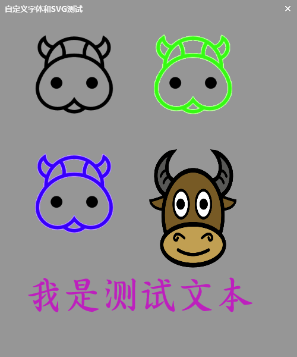

### rollmenu
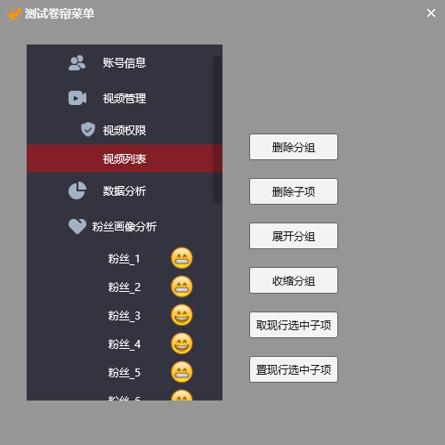

### trayicon

### login demo
