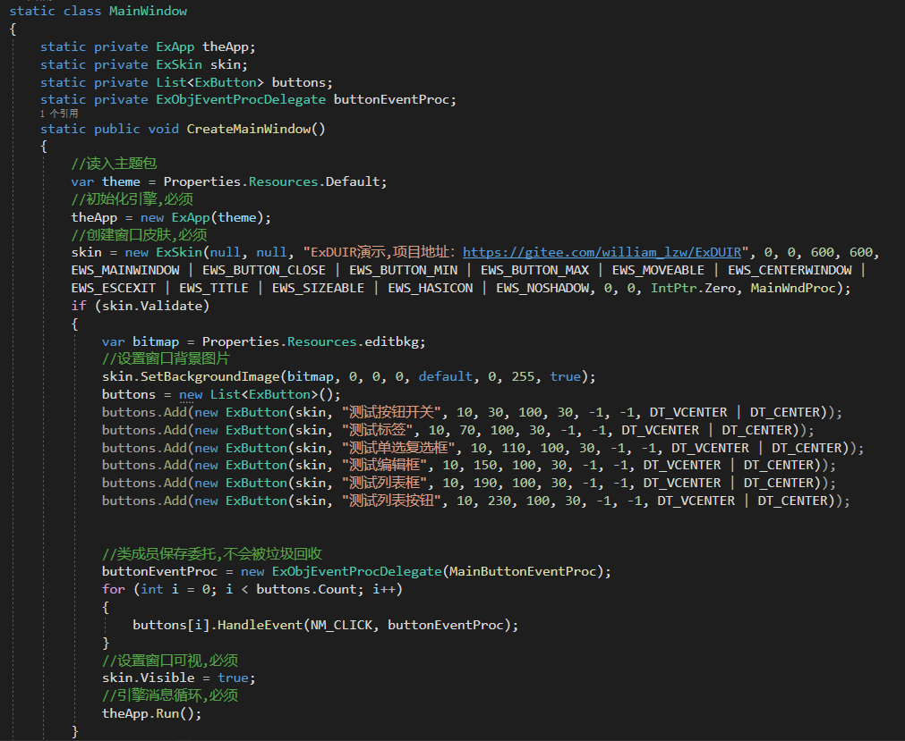
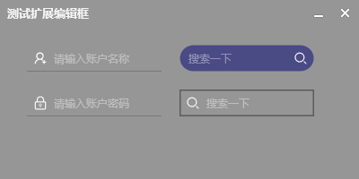

ExDUIR
=======
[中文](./README.md)

## Introduction

Lightweight DirectUI framework for Windows platform.ExDUIR for .net.

Original address:https://github.com/williamlzw/ExDUIR

Modified from https://github.com/F-Unction/ExDirectUI.NET

## Environment
win10+, win7 need install KB2670838 patch
.net 4.6.1

## Problem feedback & Help
* QQ group: 214406227

## Compiler
* Visual Studio 2019,Visual Studio 2022

## Characteristics
* Rendering function is DirectX11, Direct2D, efficiency is hundreds of times higher than GDI.
* Unicode encoding, support for multiple languages.
* Mimic The Windows messaging mechanism by sending messages and distributing notifications to components, compatible with native Windows messages and constants. Win32 API writing, more flexible than class writing extensibility.
* Use Win32 style API method to call, support the generation of lib static library and DLL dynamic library. The generated dynamic link library can be called by other languages such as python, Java, go, dephi, C#, VB, easy language, etc.
* Extension components are free and flexible, and the engine handles the underlying logic. The user only needs to write the drawing code and does not need to worry about complex message processing.
* Currently support component has a button, switch, radio buttons, select box, edit box, rich text edit box, listview, report listview, template listview, group boxes, combo boxes, menus, tree frame, the slider, radio buttons, select box, TAB, load, animations, rotating picture box, page, picture box, message box, list of ICONS, list button, the toolbar , status bar, date box, color palette, color picker, title box, calendar box, score button, cef3 browser box, drawing board, you can superclass extension components on these components.
* Support for layouts that automatically update component positions when window sizes change. Currently, the following layouts are supported: absolute layout, relative layout, linear layout, flow layout, and table layout. Users can extend the layout.
* Support GIF format images automatically play animation, support image format PNG, JPEG, BMP, GIF, WEBP. Windows or components can use the above format image as the background.
* Support 34 eases, users can freely write window eases or component eases. Users can extend the easing algorithm.
* Window support special-shaped window, picture shape window. Windows and components support 0 to 255 transparency. Supports Gaussian blur.
* Edit box supports rich text and supports loading documents in RTF format.
* Windows or components can receive drag files or text.
* Support for modal Windows.
* Support for restricted area message notification.

## Demo
### demo code:  

### demo all:  

### button:  

### combobox:  

### custombackground:  

### easing:  

### edit:  

### groupbox:  

### irregular shape window:  

### label:  

### layout absolute:  

### layout flow:  

### layout linear:  

### layout relative:  

### layout table:  

### listbutton:  

### listview:  

### navbutton:  

### radio and checkbox:  

### reportlistview:  

### iconlistview:  

### treeview:  

### modal:  

### matrix:  

### buttonex:  

### editex:  

### custommenu:  

### eventdispatch:  

### loading:  

### sliderbar:  

### rotatebox:  

### drag obj:  

### progressbar

### notify obj

### titlebar

### datebox

### colorpicker

### scorebutton

### carousel

### template listview

### drawingboard

### propertygrid

### mediaplayer

### svg and font

### rollmenu

### trayicon

### winform:  

### cefsharp browser:  

### login demo

### demo taggingboard:
